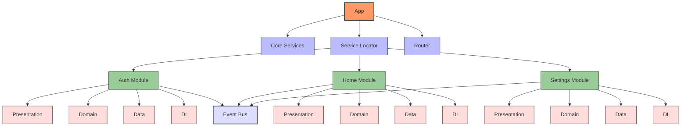
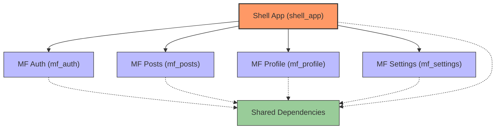
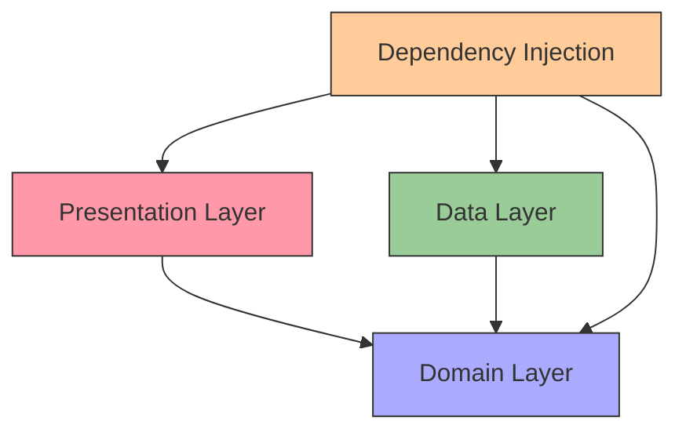
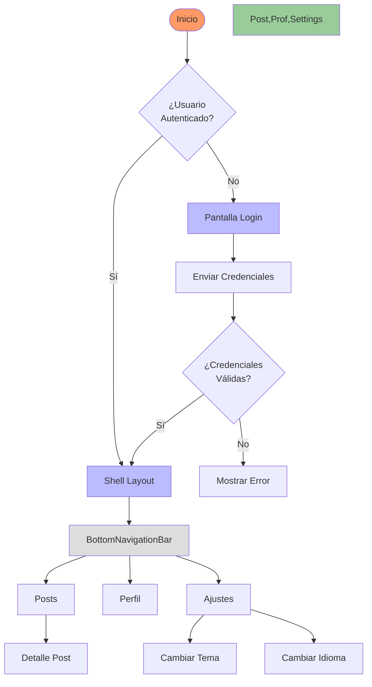
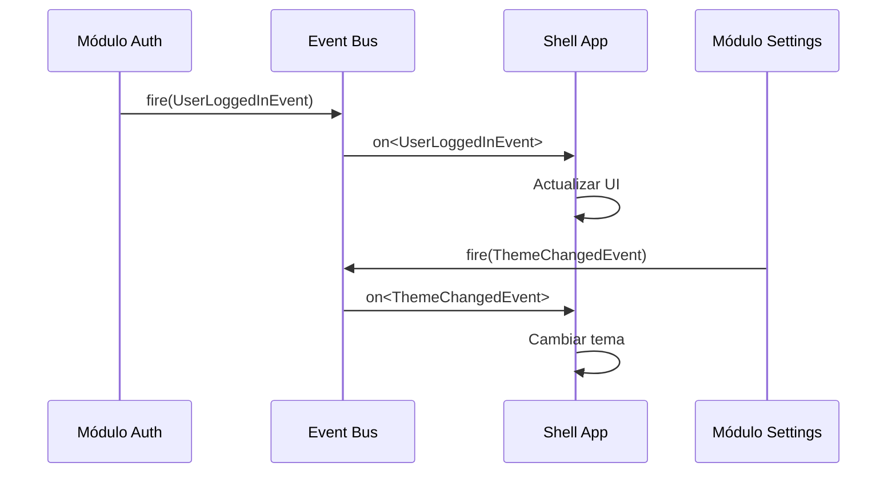

# Proyecto Flutter con Arquitectura de Microfrontends

<!-- TOC -->
- [Proyecto Flutter con Arquitectura de Microfrontends](#proyecto-flutter-con-arquitectura-de-microfrontends)
  - [Propósito y Alcance](#propósito-y-alcance)
  - [Arquitectura General](#arquitectura-general)
  - [Estructura de Carpetas](#estructura-de-carpetas)
  - [Flujo de Navegación](#flujo-de-navegación)
  - [Inyección de Dependencias](#inyección-de-dependencias)
  - [Core Services](#core-services)
  - [Event Bus y Comunicación entre Módulos](#event-bus-y-comunicación-entre-módulos)
  - [Módulos Microfrontend](#módulos-microfrontend)
    - [MF_Auth](#mf_auth)
    - [MF_Posts](#mf_posts)
    - [MF_Profile](#mf_profile)
    - [MF_Settings](#mf_settings)
  - [Buenas Prácticas](#buenas-prácticas)
  - [Guía de Desarrollo](#guía-de-desarrollo)
<!-- /TOC -->

## Propósito y Alcance

Este proyecto implementa una aplicación Flutter modular basada en arquitectura de microfrontends, con el objetivo de 
demostrar cómo organizar código escalable, mantenible y con separación clara de responsabilidades. La aplicación sirve 
como boilerplate para proyectos que requieran:

- **Escalabilidad**: Equipos diferentes pueden trabajar en módulos independientes.
- **Mantenibilidad**: Cada módulo encapsula su funcionalidad.
- **Flexibilidad**: Facilita la sustitución, actualización o eliminación de características.
- **Reutilización**: Promueve compartir componentes comunes.

La aplicación incluye funcionalidades comunes como autenticación, gestión de posts, perfiles de usuario y ajustes, 
cada una implementada como un microfrontend separado.

## Arquitectura General

La arquitectura del proyecto sigue el patrón de microfrontends para Flutter, donde:

- Una **aplicación shell** (shell_app) orquesta y compone los diferentes módulos.
- **Módulos microfrontend** (mf_*) implementan funcionalidades específicas.
- **Dependencias compartidas** (shared_dependencies) centralizan código común.

### Diagrama Detallado de la Arquitectura



### Estructura General de Módulos



Cada módulo implementa la arquitectura Clean Architecture con:



## Estructura de Carpetas

```
flutter_boilerplate_project-master/
├── shell_app/                      # Aplicación shell principal
│   ├── lib/
│   │   ├── layout/                 # Layouts compartidos (MainLayout)
│   │   ├── routes/                 # Configuración de rutas (app_router.dart)
│   │   └── main.dart               # Punto de entrada principal
├── shared_dependencies/            # Dependencias y utilidades compartidas
│   ├── lib/
│   │   ├── src/
│   │   │   ├── events/             # Sistema de eventos entre módulos
│   │   │   ├── localization/       # Localización compartida
│   │   │   └── theme/              # Temas compartidos
│   │   └── shared_dependencies.dart # Re-exportaciones
├── mf_auth/                        # Microfrontend de autenticación
├── mf_posts/                       # Microfrontend de publicaciones
├── mf_profile/                     # Microfrontend de perfil
├── mf_settings/                    # Microfrontend de configuración
└── scripts/                        # Scripts de utilidad
    └── create_mf.sh                # Script para crear nuevos módulos
```

Cada módulo microfrontend sigue la misma estructura interna:

```
mf_[nombre]/
├── lib/
│   ├── src/
│   │   ├── constants/              # Constantes del módulo
│   │   ├── data/                   # Capa de datos
│   │   │   ├── datasource/         # Fuentes de datos
│   │   │   └── repository/         # Implementaciones de repositorios
│   │   ├── di/                     # Inyección de dependencias
│   │   ├── domain/                 # Capa de dominio
│   │   │   ├── entity/             # Entidades y modelos
│   │   │   └── repository/         # Interfaces de repositorios
│   │   └── presentation/           # Capa de presentación
│   │       ├── screens/            # Pantallas UI
│   │       ├── store/              # Stores MobX
│   │       └── routes.dart         # Definición de rutas
│   └── mf_[nombre].dart            # Punto de entrada y exportaciones
```

## Flujo de Navegación

El proyecto utiliza **go_router** para la navegación, con **ShellRoute** para mantener el estado de navegación entre módulos.



La configuración principal se encuentra en `shell_app/lib/routes/app_router.dart`:

```dart
static final GoRouter router = GoRouter(
  navigatorKey: rootNavigatorKey,
  initialLocation: '/posts',
  redirect: (context, state) {
    final authStore = GetIt.instance<AuthStore>();
    final isLoggedIn = authStore.isLoggedIn;
    final isLoggingIn = state.matchedLocation == '/auth/login';
    
    // Si no está logueado y no está intentando ir a login, redirigir a login
    if (!isLoggedIn && !isLoggingIn) {
      return '/auth/login';
    }
    
    // Si está logueado y está intentando ir a login, redirigir a posts
    if (isLoggedIn && isLoggingIn) {
      return '/posts';
    }
    
    return null;
  },
  routes: [
    // Rutas de autenticación
    GoRoute(
      path: '/auth/login',
      builder: (context, state) => const LoginScreen(),
    ),
    
    // Shell Route para la aplicación principal
    ShellRoute(
      navigatorKey: shellNavigatorKey,
      builder: (context, state, child) => MainLayout(child: child),
      routes: [
        // Rutas de los módulos (proporcionadas por cada microfrontend)
        ...PostsRoutes.routes,
        ...ProfileRoutes.routes,
        ...SettingsRoutes.routes,
      ],
    ),
  ],
);
```

Cada módulo expone sus rutas a través de una clase estática que es importada por el shell:

```dart
// Ejemplo de mf_posts/lib/src/presentation/routes.dart
class PostsRoutes {
  static final routes = [
    GoRoute(
      path: '/posts',
      builder: (context, state) => const PostListScreen(),
      routes: [
        GoRoute(
          path: ':id',
          builder: (context, state) => PostDetailScreen(
            postId: state.pathParameters['id']!,
          ),
        ),
      ],
    ),
  ];
}
```

## Inyección de Dependencias

El proyecto utiliza **GetIt** como Service Locator para la inyección de dependencias. Cada módulo expone un método
`init()` para registrar sus dependencias:

```dart
// Ejemplo de mf_auth/lib/src/di/auth_module.dart
class AuthModule {
  static Future<void> init() async {
    final getIt = GetIt.instance;
    
    // Datasources
    getIt.registerLazySingleton<AuthDatasource>(
      () => AuthDatasourceImpl(preferences: getIt()),
    );
    
    // Repositories
    getIt.registerLazySingleton<AuthRepository>(
      () => AuthRepositoryImpl(datasource: getIt()),
    );
    
    // Stores
    getIt.registerLazySingleton<AuthStore>(
      () => AuthStore(authRepository: getIt()),
    );
    
    getIt.registerFactory<FormStore>(
      () => FormStore(),
    );
  }
}
```

En el `main.dart` de la aplicación shell, se inicializan todos los módulos:

```dart
Future<void> main() async {
  WidgetsFlutterBinding.ensureInitialized();
  
  // Inicializar módulos
  await AuthModule.init();
  await PostsModule.init();
  await ProfileModule.init();
  await SettingsModule.init();
  
  runApp(const MyApp());
}
```

## Core Services

Los servicios core están disponibles a través del módulo `shared_dependencies`:

| Servicio | Descripción | Uso |
|----------|-------------|-----|
| **GlobalEventBus** | Bus de eventos para comunicación entre módulos | `GlobalEventBus.instance.fire(new UserLoggedInEvent('userId'))` |
| **AppLocalizations** | Manejo de idiomas | `AppLocalizations.of(context).translate('key')` |
| **SharedThemeProvider** | Temas compartidos | `SharedThemeProvider.lightThemeData` |
| **SharedPreferences** | Almacenamiento local | Inyectado a través de GetIt |
| **DioClient** | Cliente HTTP | Inyectado en repositorios para llamadas API |
| **SembastClient** | Base de datos local | Inyectado para persistencia offline |

## Event Bus y Comunicación entre Módulos

La comunicación entre módulos se realiza mediante el patrón de bus de eventos. El proyecto implementa un `GlobalEventBus`
que permite la comunicación desacoplada:

```dart
// Publicar un evento
GlobalEventBus.instance.fire(UserLoggedInEvent('user123'));

// Suscribirse a eventos
GlobalEventBus.instance.on<UserLoggedInEvent>().listen((event) {
  print('Usuario logueado: ${event.userId}');
});
```

Eventos principales:

| Evento | Propósito | Datos |
|--------|-----------|-------|
| **UserLoggedInEvent** | Notifica cuando un usuario inicia sesión | `userId` |
| **UserLogoutEvent** | Notifica cuando un usuario cierra sesión | Ninguno |
| **ThemeChangedEvent** | Notifica cambios de tema | `isDarkMode` |
| **LanguageChangedEvent** | Notifica cambios de idioma | `languageCode` |

Ejemplo de flujo completo:



## Módulos Microfrontend

### MF_Auth

**Propósito**: Gestionar autenticación y autorización.

**Capas**:
- **Presentation**: Pantallas de login, registro y recuperación de contraseña
- **Domain**: Entidades User, Token y contratos de repositorios
- **Data**: Implementaciones con API REST y almacenamiento local
- **DI**: Inyección de dependencias específicas de autenticación

**Rutas**:
- `/auth/login` - Pantalla de inicio de sesión
- `/auth/register` - Registro de nuevos usuarios
- `/auth/password-reset` - Recuperación de contraseña

**Stores Principales**:
- `AuthStore`: Gestiona estado de autenticación (isLoggedIn, currentUser)
- `FormStore`: Validación de formularios (email, password)

**Ejemplo de uso**:
```dart
// Obtener store de autenticación
final authStore = GetIt.instance<AuthStore>();

// Iniciar sesión
await authStore.login(email, password);

// Verificar estado
if (authStore.isLoggedIn) {
  context.go('/posts');
}
```

### MF_Posts

**Propósito**: Gestionar publicaciones y su interacción.

**Capas**:
- **Presentation**: Pantallas de lista y detalle de posts
- **Domain**: Entidades Post, Comment y contratos de repositorios
- **Data**: Implementaciones con API REST y caché local
- **DI**: Inyección de dependencias específicas de posts

**Rutas**:
- `/posts` - Lista de publicaciones
- `/posts/:id` - Detalle de publicación individual

**Stores Principales**:
- `PostStore`: Gestiona lista de posts, estado de carga y errores

**Ejemplo de uso**:
```dart
// Obtener store de posts
final postStore = GetIt.instance<PostStore>();

// Cargar posts
await postStore.getPosts();

// Acceder a datos
if (!postStore.loading) {
  final posts = postStore.posts;
}
```

### MF_Profile

**Propósito**: Gestionar perfil de usuario.

**Capas**:
- **Presentation**: Pantalla de perfil y edición
- **Domain**: Entidades relacionadas con el perfil
- **Data**: Implementaciones para guardar y recuperar datos de perfil
- **DI**: Inyección de dependencias específicas de perfil

**Rutas**:
- `/profile` - Pantalla principal de perfil
- `/profile/edit` - Edición de perfil

**Stores Principales**:
- `ProfileStore`: Gestiona datos del perfil y su edición

### MF_Settings

**Propósito**: Gestionar configuraciones de la aplicación.

**Capas**:
- **Presentation**: Pantalla de ajustes
- **Domain**: Entidades como Language, Theme
- **Data**: Implementaciones para persistir preferencias
- **DI**: Inyección de dependencias específicas de ajustes

**Rutas**:
- `/settings` - Pantalla principal de ajustes

**Stores Principales**:
- `ThemeStore`: Gestiona tema claro/oscuro
- `LanguageStore`: Gestiona idioma de la aplicación

**Ejemplo de uso**:
```dart
// Cambiar tema
final themeStore = GetIt.instance<ThemeStore>();
themeStore.toggleTheme();

// Cambiar idioma
final languageStore = GetIt.instance<LanguageStore>();
languageStore.changeLanguage('es');
```

## Buenas Prácticas

| Categoría | Descripción | Herramienta |
|-----------|-------------|-------------|
| **Formato de Código** | Mantener consistencia en el código | `flutter format .` |
| **Análisis de Código** | Verificar calidad y evitar problemas | `flutter analyze` |
| **Convenciones de Nombres** | Usar snake_case para archivos, lowerCamelCase para variables/métodos | analysis_options.yaml |
| **Estructura de Carpetas** | Seguir la estructura del proyecto para nuevos módulos | Scripts |
| **Importaciones** | Usar importaciones relativas dentro del módulo, absolutas entre módulos | analysis_options.yaml |
| **Exportaciones** | Exportar solo lo necesario en el archivo barrel | mf_*.dart |
| **Inyección de Dependencias** | Registrar servicios en el módulo correcto | AuthModule.init() |
| **Navegación** | Definir rutas en el archivo routes.dart del módulo | routes.dart |

**Checklist**:
- [ ] ¿El código pasa análisis estático? `flutter analyze`
- [ ] ¿El código sigue las convenciones de estilo? `flutter format --set-exit-if-changed .`
- [ ] ¿Se han documentado las clases y métodos públicos?
- [ ] ¿El módulo expone solo lo necesario?
- [ ] ¿Las dependencias están correctamente registradas?
- [ ] ¿Las rutas siguen el patrón establecido?
- [ ] ¿El código incluye tests unitarios y de widgets?

## Guía de Desarrollo

**Crear un nuevo módulo microfrontend**:

1. Ejecutar el script de creación:
   ```bash
   ./scripts/create_mf.sh nombre_modulo
   ```

2. Registrar el módulo en el shell_app:
   ```dart
   // shell_app/pubspec.yaml
   dependencies:
     mf_nombre_modulo:
       path: ../mf_nombre_modulo
   ```

3. Inicializar el módulo en main.dart:
   ```dart
   // shell_app/lib/main.dart
   import 'package:mf_nombre_modulo/mf_nombre_modulo.dart';
   
   Future<void> main() async {
     // ...
     await NombreModuloModule.init();
     // ...
   }
   ```

4. Incluir las rutas en el router:
   ```dart
   // shell_app/lib/routes/app_router.dart
   import 'package:mf_nombre_modulo/mf_nombre_modulo.dart';
   
   // ...
   routes: [
     // ...
     ...NombreModuloRoutes.routes,
   ]
   ``` 